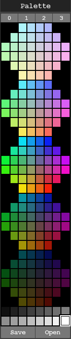

# hls_palette
A Hue-Lightness-Saturation (HLS) based palette for MagicaVoxel

# Overview
This script generates a MagicaVoxel palette based on a series of slices through the HLS (aka HSL) colour model. I find this more organised than the default palette, while also providing the light and dark colours which are missing from some other hue-based palettes. The generated disks do not include pure greys so those are provided at the bottom.

# Usage
Download [hls.png](/hls.png) and place in in your MagicaVoxel 'palette' folder. Then click 'Open' from the 'Palette' panel on the left-hand side and select the downloaded file.

# License
The code and resulting palette are released as Public Domain under the Creative Commons Zero license.
